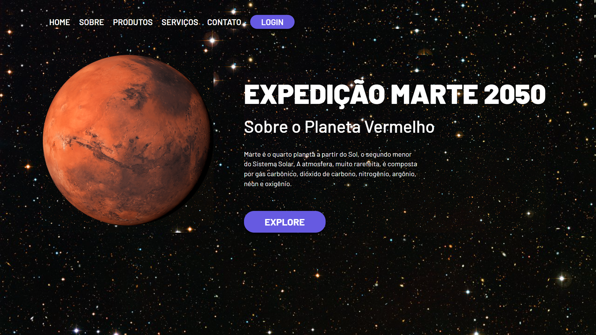

# Mars-ladding-page-

  

> Resultado do Mars ladding page

### O projeto foi feito para o treinamento e fixação de conteudo de HTML e CSS 

<table>
  <tr>
    <td align="center">
      <a href="#">
         
        
          <b>Gustavo Mendes </b>
        
      </a>
    </td>
  
</table>

